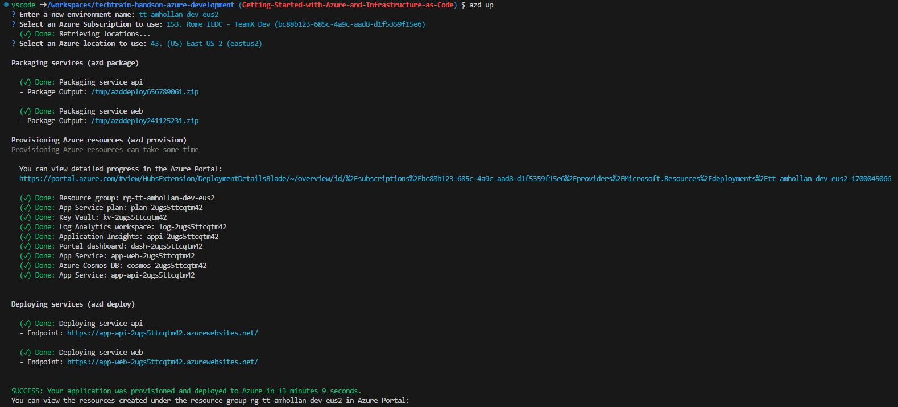
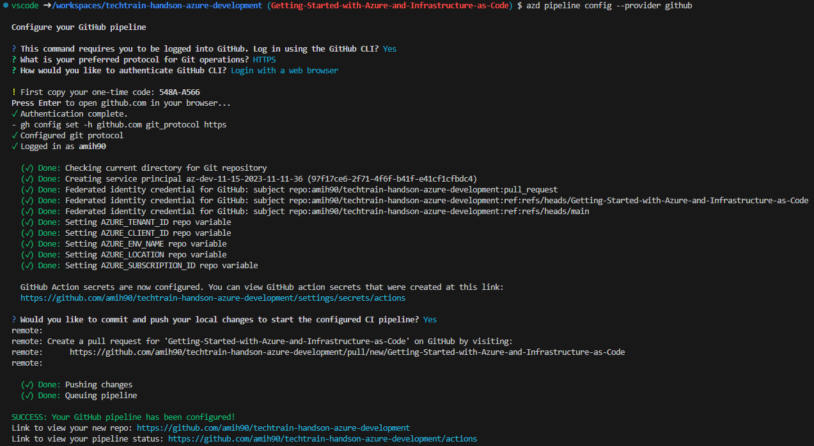
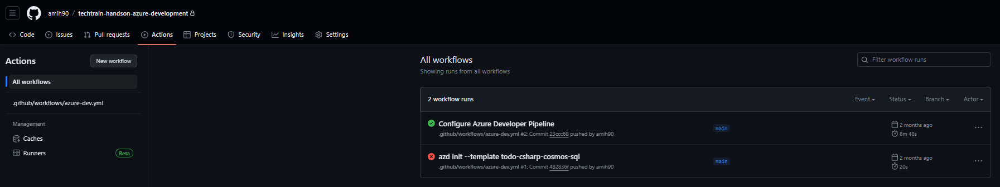

# Workshop: Azd init

- [Introduction](#introduction)
- [Learning Objectives](#learning-objectives)
- [Challenges](#challenges)
    - [Challenge 1: Bootstrapping and provisioning an initial template for your Azure environment](#challenge-1)
    - [Challenge 2 (<span style="color:green"><b>Optional</b></span>): Configure CI/CD using Github Actions](#challenge-2)
- [Additional Resources](#additional-resources)

## Introduction <a name="introduction"></a>
Azure Developer CLI (azd) is an open-source tool that accelerates the time it takes for you to get your application from local development environment to Azure. azd provides best practice, developer-friendly commands that map to key stages in your workflow, whether you’re working in the terminal, your editor or integrated development environment (IDE), or CI/CD (continuous integration/continuous deployment). You can use azd with extensible blueprint templates that include everything you need to get an application up and running on Azure. These templates include reusable infrastructure as code assets and proof-of-concept application code that can be replaced with your own app code. You can also create your own template or find one to build upon.

* [azure.yaml](https://learn.microsoft.com/en-us/azure/developer/azure-developer-cli/azd-schema) - A metadata that is used to configure Azure resources for deployment.

## Learning Objectives <a name="learning-objectives"></a>
1. Leveraging azd to accelerates the time it takes for you to get your application from development environment to Azure.

## Challenges <a name="challenges"></a>
1. Bootstrapping and provisioning an initial template for your Azure environment.
1. Configure CI/CD using Github Actions.

### Challenge 1: Bootstrapping and provisioning an initial template for your Azure environment <a name="challenge-1"></a>

1. Provision cloud resources:
    1. Open new terminal: **Menu** -> **Terminal** -> **New Terminal** (or `Ctrl` + `Shift` + `~`).
    1. Execute `azd auth login` to authenticate Azure Developer CLI with your Azure Account
    1. Update azd environment with your user principal id, to allow you to access services dataplane and run application locally:

        ```bash
        # Retrieve your user object id from Azure Entra ID
        objectId=$(az ad signed-in-user show --query id -o tsv)

        azd env set AZURE_PRINCIPAL_ID $objectId
        ```

        > **Note**: this will update your azd environment under <b>.azure/<environment-name>/.env</b> file and will be populated while provisioning azure resources via <b>main.parameters.json</b> file.
    1. Provision Azure Resources:
        1. Run the `azd up` command:

            ```azdeveloper
            azd up
            ```

        1. Pick a new environment name in the following format **tt-&lt;your-alias&gt;-dev-&lt;location&gt;** (for example tt-amhollan-dev-eus2).
        1. Once you are signed-in to Azure, you will be prompted for the following information:

            | Parameter | Description |
            | --------- | ----------- |
            | `Azure Location`   | The Azure location where your resources will be deployed. |
            | `Azure Subscription` | The Azure Subscription where your resources will be deployed. |

        After you provide these values, the `azd up` command:

        - Creates and configures all necessary Azure resources (`azd provision`), including:
        - Access policies and roles for your account
        - Service-to-service communication with Managed Identities
        - Packages and deploys the code (`azd deploy`)

        > **Note**: This might take a few minutes and you can monitor the progress in the terminal, or in Azure Portal via the link under **Provisioning Azure resources** step.

        

1. Test your new ToDo application:
    1. Under **Deploying services** step, click on the **service web** endpoint to open your ToDo App UI. You can find it also using the following command:

        ```bash
        # Showing deployed endpoints and environments for apps in this directory.
        azd show

        # Showing deployed specific app endpoint
        azd show | grep "web" | awk '{print $2}'
        ```
    1. Create new ToDo lists and items at least three for each.

1. Go to Azure Portal, locate and review resources created.
1. Use `azd monitor` command whose parameters launch various Application Insights dashboards. Run any of the following commands in the project directory to monitor app health:

    | Application Insights dashboard | Command |
    |---|---|
    | Main dashboard | azd monitor --overview |
    | Live metrics dashboard |azd monitor --live |
    | Logs dashboard | azd monitor --logs |


### Challenge 2 (<span style="color:green"><b>Optional</b></span>): Configure CI/CD using Github Actions <a name="challenge-2"></a>
> <span style="color:red"><b>Prerequisite</b></span>: The following challenge requires a GitHub account.

CI/CD stands for Continuous Integration/Continuous Delivery. It is a software development practice that aims to automate the building, testing, and deployment of code changes. CI/CD helps developers deliver high-quality software faster and more reliably.

GitHub Actions is a feature of GitHub that allows you to create and run workflows for your repository. Workflows are composed of jobs, which are individual steps that can run commands, scripts, or actions. Actions are reusable pieces of code that can perform tasks such as installing dependencies, running tests, or deploying applications. You can use actions from the GitHub Marketplace or create your own.

To use GitHub Actions for CI/CD, you need to create a YAML file in your repository under the .github/workflows directory. This file defines the triggers, jobs, and actions for your workflow. For example, you can trigger a workflow when you push code to a branch, open a pull request, or create a release. You can also specify the environment, secrets, and artifacts for your workflow.

The course content based on azd template that already contains a Github Action workflow file under **.github/workflows/azure-dev.yml**. This workflow file is configured to run on every push to the **main** branch and will execute the following steps:

1. To configure the workflow, you need to give GitHub permission to deploy to Azure on your behalf. Authorize GitHub by creating an Azure service principal stored in a GitHub secret named AZURE_CREDENTIALS.
    ```bash
    azd pipeline config --provider github
    ```
1. Supply the requested GitHub information.
1. When prompted about committing and pushing your local changes to start a new GitHub Actions run, specify y.
1. In the terminal window, view the results of the azd pipeline config command. The azd pipeline config command will output the GitHub repository name for your project.

1. Using your browser, open the GitHub repository for your project.
 1. Select **Actions** tab to see the workflow running..
1. Validate workflow run status is green.


## Additional Resources <a name="additional-resources"></a>
| Name | Description |
| --- | --- |
| [Azure Developer CLI](https://learn.microsoft.com/en-us/azure/developer/azure-developer-cli/) | Azure Developer CLI (azd) documentation |
| [Github Marketplace](https://github.com/marketplace?query=Azure&type=actions) | GitHub Marketplace provides a curated collection of tools, applications, and services that can be integrated seamlessly with GitHub repositories. |
| [Github - Azure authentication](https://learn.microsoft.com/en-us/azure/developer/github/connect-from-azure?tabs=azure-portal%2Clinux#set-up-azure-login-with-openid-connect-authentication) | Set up Azure Login with OpenID Connect authentication |

