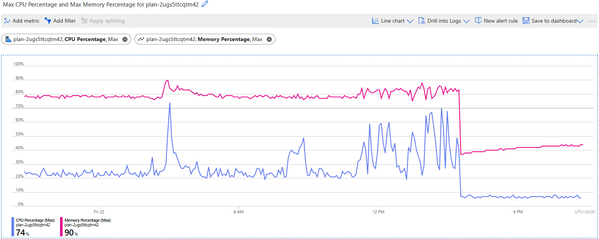
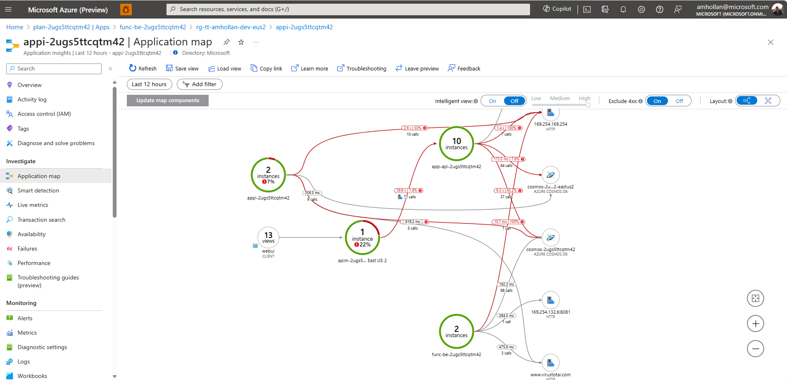
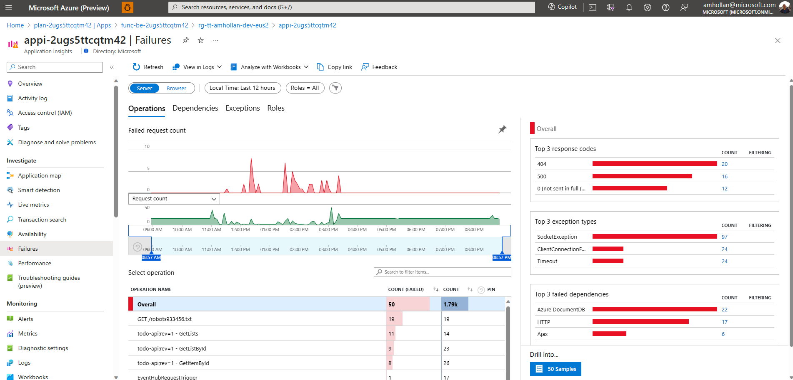

1. monitor
2. scale app service plan
note the applications are sharing the same compute resources.

After the deployment we can might suffer from performance issues. We can monitor the application using the Azure Portal. We can also scale the App Service Plan to a higher tier.

